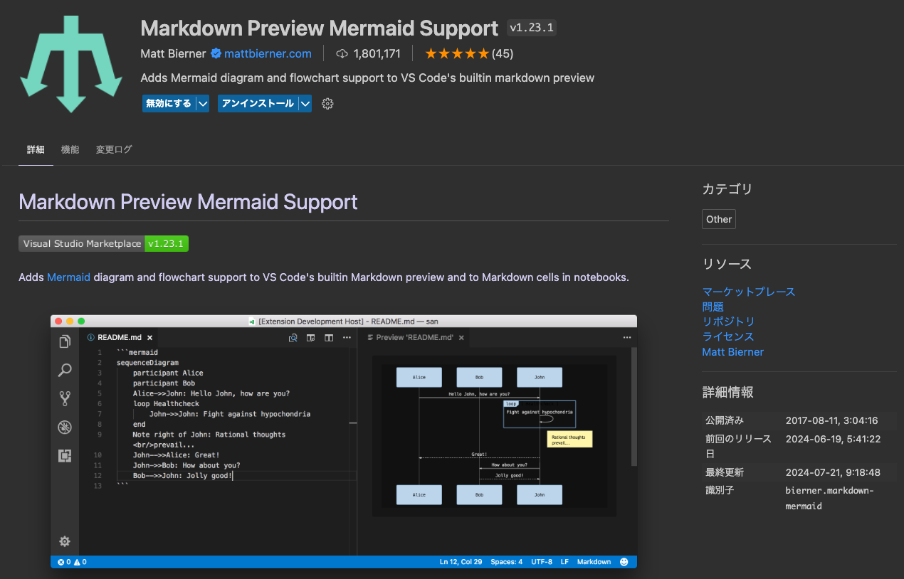
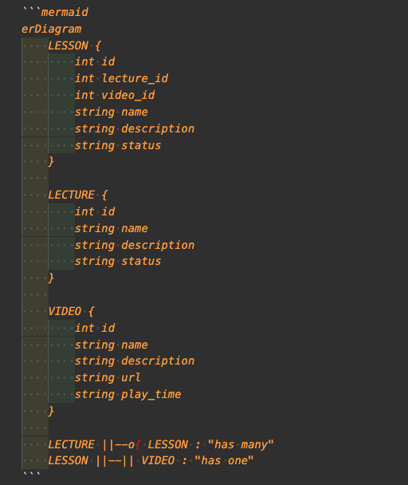
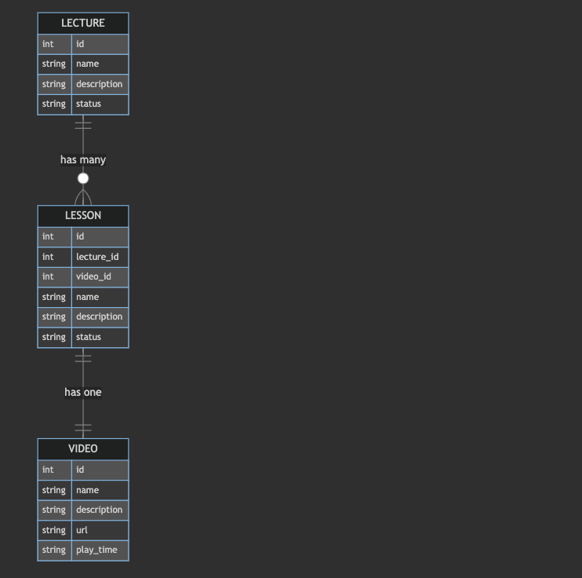
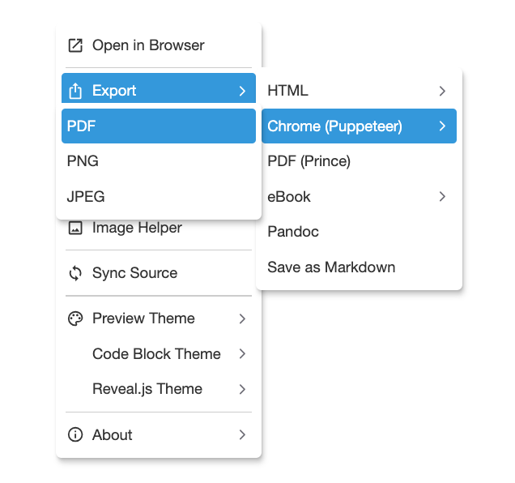

# VSCodeでMermaidを扱うための便利な拡張機能

Mermaidとは、コードベースでガントチャートやフロー図などの作図が可能なJavaScriptのライブラリです。2022年にはGitHubやQiitaでもサポートされるようになり、Markdown内に専用のコードを書くことで図の挿入ができるようになりました。

[Online FlowChart & Diagrams Editor - Mermaid Live Editor](https://mermaid.live/)というサイトでも記載できますが、VSCodeでも編集してプレビュー表示したいというユースケースがあるため、備忘録として記載します。

## VSCodeでMermaid記法のコードをプレビューする拡張機能

[Preview Mermaid Support - Visual Studio Marketplace](https://marketplace.visualstudio.com/items?itemName=bierner.markdown-mermaid)



拡張機能のダウンロードが完了したら、以下のように記載してプレビューすることでMermaid記法で書いたコードが図として表示されます。<br>
※` ```mermaid` と記載しないとただのコードとして認識され、図が表示されないので注意してください。


### プレビュー



## おまけ

### マークダウンで記載したファイルをpdf出力する
[Markdown Preview Enhanced ](https://marketplace.visualstudio.com/items?itemName=shd101wyy.markdown-preview-enhanced)拡張機能をvscodeにインストールします。

インストール後、mdファイルをプレビューで開き、以下の手順を実施することでプレビューしたファイルと同階層にpdfファイルが出力されます。
1. 右クリック
2. Exportをクリック
3. Chrome(Puppeteer)→PDFをクリック


